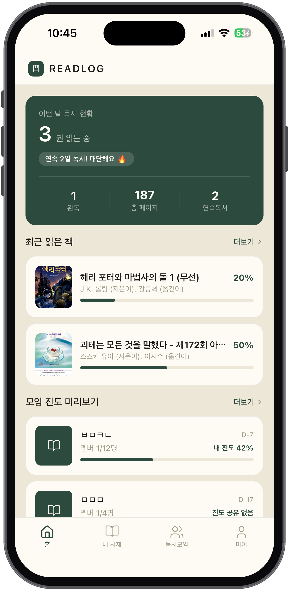
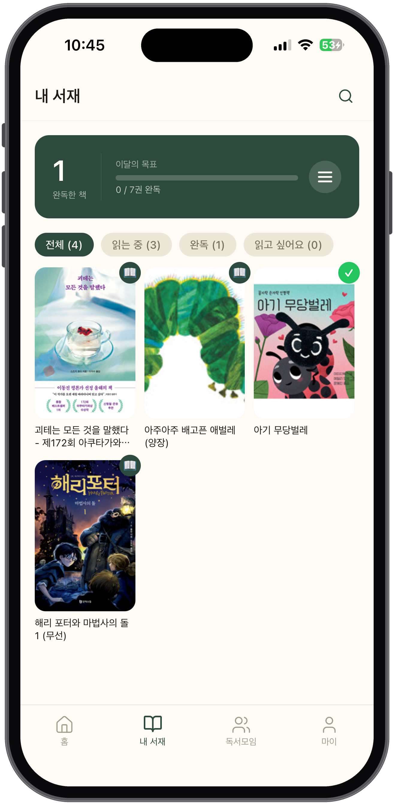
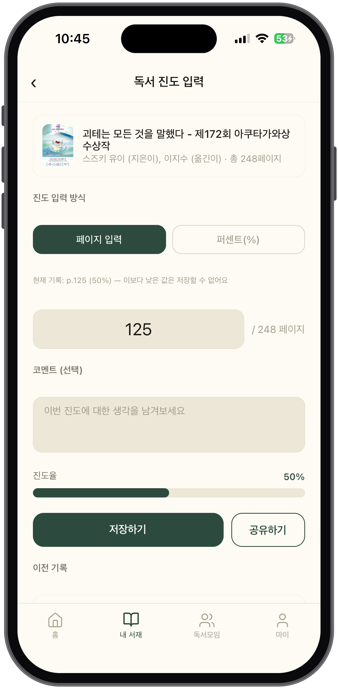
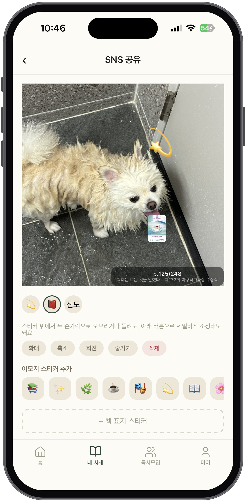
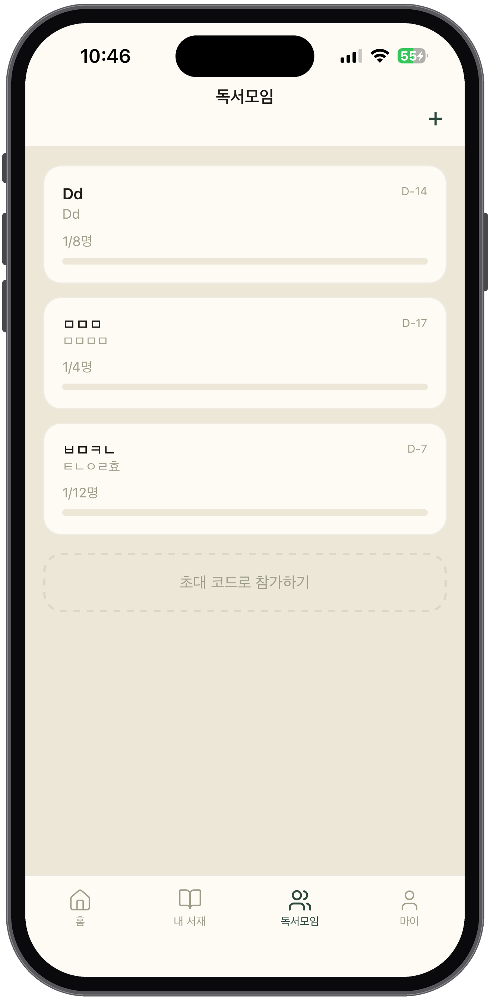
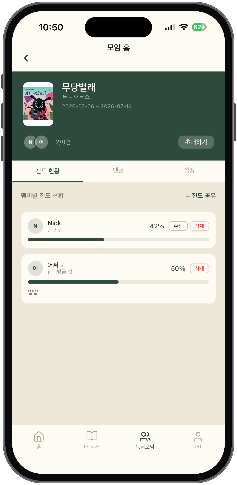
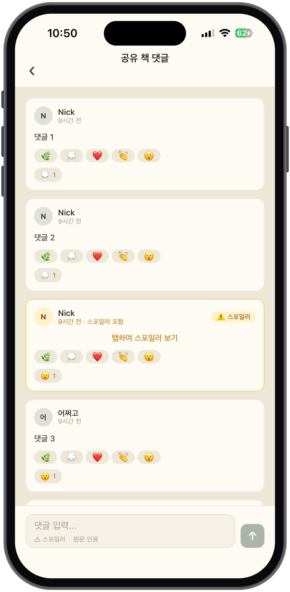
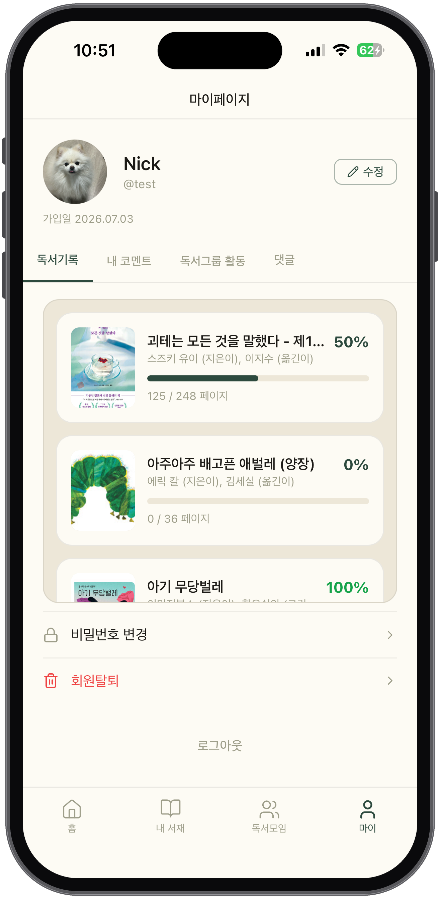

# 📚 ReadLog

**나만의 독서 기록, 함께하는 독서.**
개인 독서 습관 관리와 소셜 독서모임을 하나로 묶은 모바일 앱입니다.

| | |
|---|---|
| **Frontend** | React Native (Expo, TypeScript) |
| **Backend** | FastAPI (Python) |
| **DB / Cache** | MySQL / Redis |
| **인증** | 세션 기반 |

---

## 시작하기 전에

이 리포지토리에서 작업한다면 **[`CLAUDE.md`](./CLAUDE.md)** 를 먼저 읽으세요. 팀 모듈 소유권, Git 협업 규칙, 코딩 컨벤션이 정의되어 있습니다.

디렉토리 구조 상세 설명: [`docs/DIRECTORY_STRUCTURE.md`](./docs/DIRECTORY_STRUCTURE.md)

---

## 스크린샷

### 홈 — 이번 달 독서 현황 & 연속독서

내 서재의 독서 진도와 독서모임 진도 공유를 모두 반영해 연속독서(스트릭)를 계산하고, 최근 읽은 책과 참여 중인 모임의 진도를 한눈에 보여줍니다.



### 내 서재 — 책 등록 & 진도 관리

읽는 중 / 완독 / 읽고 싶어요 상태별로 서재를 관리하고, 이달의 완독 목표를 추적합니다.



### 독서 진도 입력 — 페이지 또는 퍼센트로 기록

페이지/퍼센트 중 원하는 방식으로 진도를 기록하고, 그 순간의 생각을 코멘트로 남길 수 있습니다. 이전 기록은 진행률 바와 함께 타임라인으로 남습니다.



### SNS 공유 — 진도 스티커로 독서 인증

사진에 이모지 스티커와 진도 오버레이(현재 페이지/전체 페이지)를 얹어 인스타그램 등으로 바로 공유할 수 있습니다.



### 독서모임 — 목록 & 참가

참여 중인 모임을 카드로 모아 보고, 초대 코드로 새 모임에 바로 참가할 수 있습니다.



### 모임 홈 — 멤버별 진도 현황

모임에 등록된 도서와 멤버 목록, 멤버별 진도 현황을 확인하고 새 진도를 공유할 수 있습니다.



### 공유 책 댓글 — 스포일러 방지

모임원들과 책에 대한 생각을 나누되, 스포일러로 표시한 댓글은 블러 처리되어 직접 눌러야 내용이 보입니다.



### 마이페이지 — 활동 모아보기

독서기록 / 내 코멘트 / 독서그룹 활동 / 댓글 탭으로 내 활동을 한 곳에서 모아 봅니다.



> 위 스크린샷 이미지 파일은 `docs/screenshots/` 아래에 다음 이름으로 저장해야 표시됩니다:
> `home.png`, `my-library.png`, `progress-input.png`, `sns-share.png`, `group-list.png`, `group-home.png`, `comments.png`, `mypage.png`

---

## 주요 기능

**개인 독서**
- 책 검색/등록 및 내 서재 관리 (읽는 중 / 완독 / 읽고 싶어요)
- 페이지·퍼센트 진도 입력 + 진도별 코멘트, 이전 기록 타임라인
- SNS 공유 화면에서 이모지·진도 오버레이 스티커로 인증샷 제작

**소셜 독서모임**
- 독서모임 개설(내 서재에서 진행 도서 선택) / 초대 코드·링크로 참가
- 멤버별 진도 현황판, 진도 공유
- 스포일러 방지 댓글(블러 처리) + 이모지 반응
- 모임 설정에서 멤버 강퇴/권한 위임, 최대 인원 조정

**계정 & 홈**
- 로그인/회원가입, 프로필 수정, 비밀번호 변경, 회원탈퇴
- 마이페이지에서 독서기록·코멘트·모임활동·댓글을 탭으로 모아보기
- 홈 대시보드: 이번 달 독서 현황, 연속독서 스트릭, 최근 읽은 책·모임 미리보기

---

## 기술 스택

| 영역 | 기술 |
|---|---|
| Frontend | React Native (Expo, TypeScript), React Navigation |
| Backend | FastAPI, SQLAlchemy 2.0, Pydantic v2 |
| DB | MySQL |
| 세션/캐시 | Redis |
| 기타 | react-native-keyboard-controller, react-native-safe-area-context, react-native-share |

---

## 팀 & 모듈 소유권

| 담당 | 모듈 | 화면 |
|---|---|---|
| A | `auth` | 로그인/회원가입/마이페이지/프로필/비밀번호/탈퇴 |
| B | `reading_plan` | 책검색/서재/진도입력/한줄평/SNS공유 |
| C | `reading_group` | 독서모임 목록/개설/참가/홈/초대/진도공유/댓글/설정 |

모듈 경계와 브랜치/커밋 규칙은 [`CLAUDE.md`](./CLAUDE.md)에서 확인하세요.

---

## 시작하기

### Backend

```bash
cd backend
python -m venv .venv && source .venv/bin/activate
pip install -r requirements.txt
# .env에 MYSQL_*, REDIS_*, ALADIN_API_KEY 등을 설정
uvicorn main:app --reload
```

### Frontend

```bash
cd frontend
npm install
# .env에 EXPO_PUBLIC_API_BASE_URL 설정
npx expo start
```

Development build(네이티브 모듈 포함) 기준으로 동작합니다 — Expo Go 대신 `npx expo run:ios` / `npx expo run:android`로 빌드해 사용하세요.

---

## 문서

- [`docs/DIRECTORY_STRUCTURE.md`](./docs/DIRECTORY_STRUCTURE.md) — 전체 디렉토리 구조
- [`docs/api-contracts/`](./docs/api-contracts/) — 모듈별 API 계약
- [`docs/db/schema.sql`](./docs/db/schema.sql) — DB 스키마
